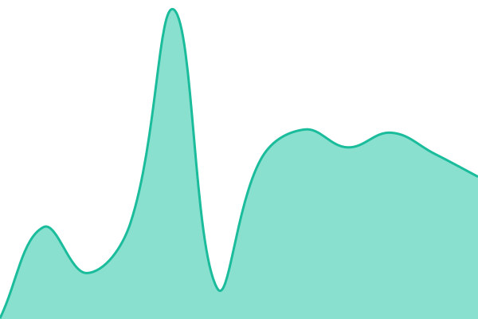

# [📈 Live Status](https://status.mappinest.com): <!--live status--> **🟩 All systems operational**

This repository contains the open-source uptime monitor and status page for [undefined](https://status.mappinest.com), powered by [Upptime](https://github.com/upptime/upptime).

With [Upptime](https://upptime.js.org), you can get your own unlimited and free uptime monitor and status page, powered entirely by a GitHub repository. We use [Issues](https://github.com/undefined/undefined/issues) as incident reports, [Actions](https://github.com/undefined/undefined/actions) as uptime monitors, and [Pages](https://status.mappinest.com) for the status page.

<!--start: status pages-->
<!-- This summary is generated by Upptime (https://github.com/upptime/upptime) -->
<!-- Do not edit this manually, your changes will be overwritten -->
<!-- prettier-ignore -->
| URL | Status | History | Response Time | Uptime |
| --- | ------ | ------- | ------------- | ------ |
|  [Mappinest Website](https://mappinest.com) | 🟩 Up | [mappinest-website.yml](https://github.com/mappinest/mappinest-status/commits/HEAD/history/mappinest-website.yml) | 

 424ms
     
 | 

<a href="https://status.mappinest.com/history/mappinest-website">100.00%</a>
    

|  [Studio / Console](https://mappinest.com/login) | 🟩 Up | [studio-console.yml](https://github.com/mappinest/mappinest-status/commits/HEAD/history/studio-console.yml) | 

 295ms
     
 | 

<a href="https://status.mappinest.com/history/studio-console">100.00%</a>
    

|  Raster Tiles API | 🟩 Up | [raster-tiles-api.yml](https://github.com/mappinest/mappinest-status/commits/HEAD/history/raster-tiles-api.yml) | 

 1253ms
     
 | 

<a href="https://status.mappinest.com/history/raster-tiles-api">100.00%</a>
    

|  Vector Tiles API | 🟩 Up | [vector-tiles-api.yml](https://github.com/mappinest/mappinest-status/commits/HEAD/history/vector-tiles-api.yml) | 

 226ms
     
 | 

<a href="https://status.mappinest.com/history/vector-tiles-api">100.00%</a>
    

|  Maps API | 🟩 Up | [maps-api.yml](https://github.com/mappinest/mappinest-status/commits/HEAD/history/maps-api.yml) | 

 898ms
     
 | 

<a href="https://status.mappinest.com/history/maps-api">100.00%</a>
    

<!--end: status pages-->

[**Visit our status website →**](https://status.mappinest.com)

## 📄 License

- Powered by: [Upptime](https://github.com/upptime/upptime)
- Code: [MIT](./LICENSE) © [Anand Chowdhary](https://anandchowdhary.com)
- Data in the `./history` directory: [Open Database License](https://opendatacommons.org/licenses/odbl/1-0/)
